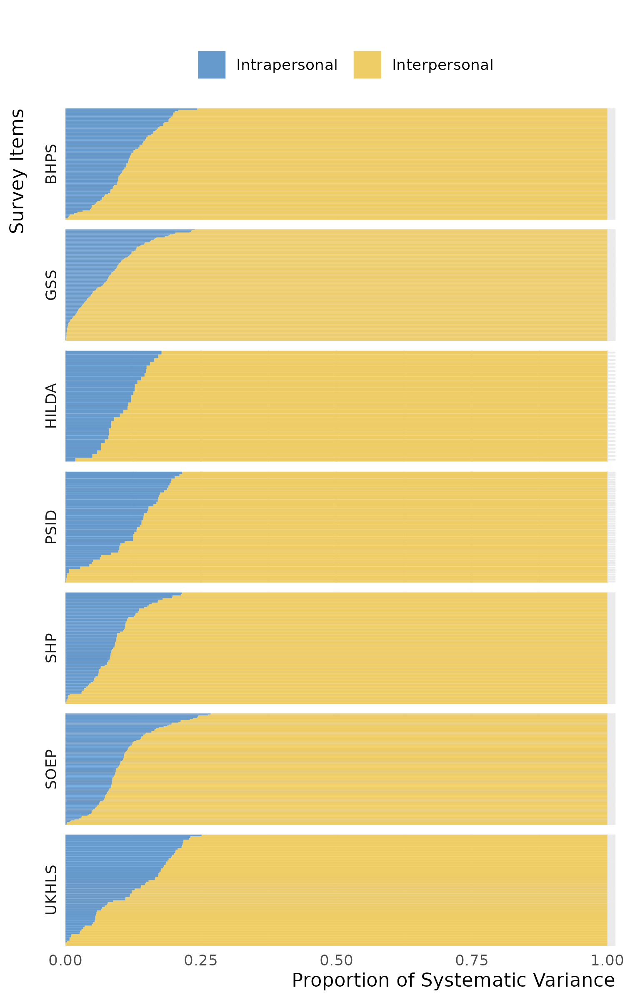
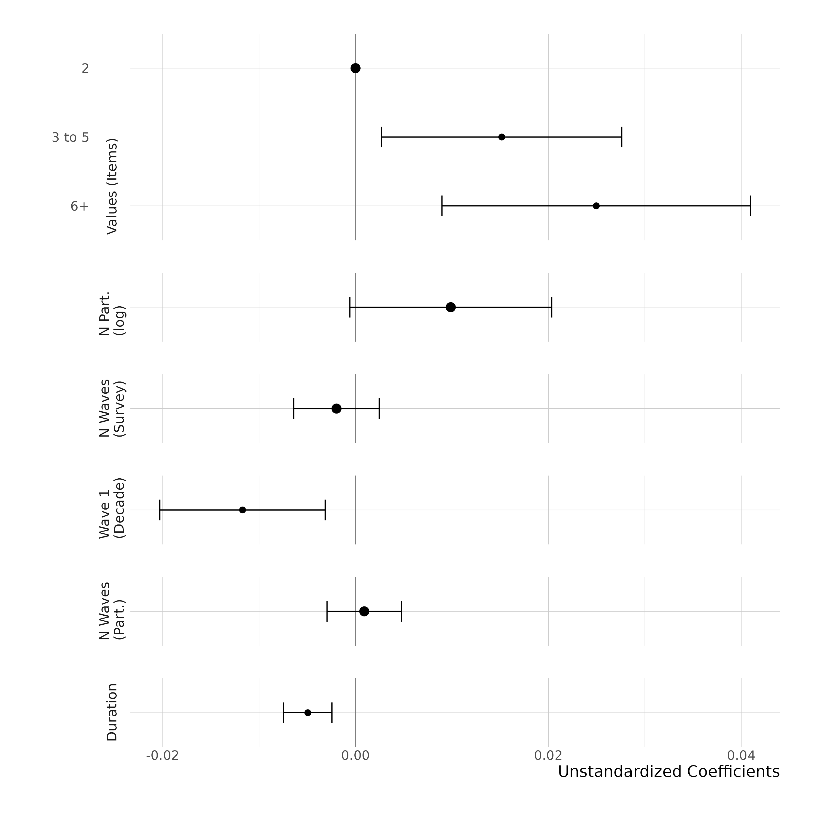
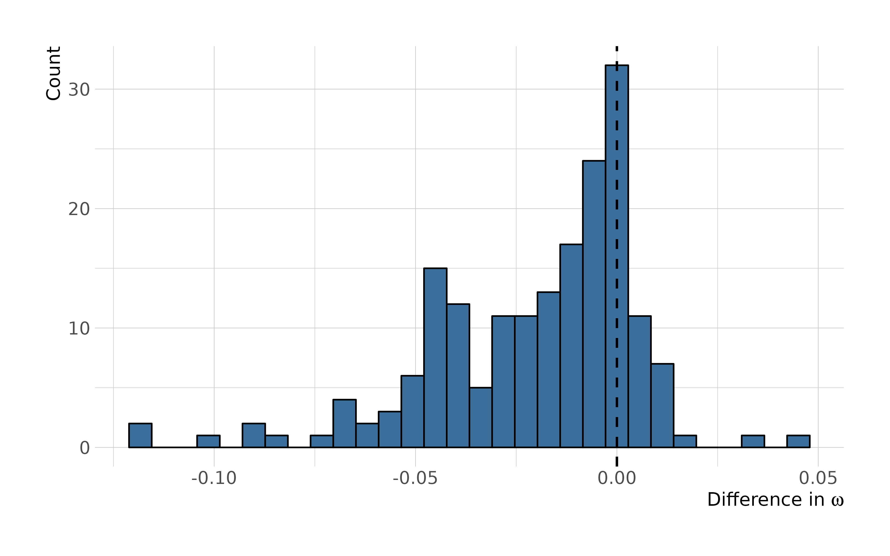
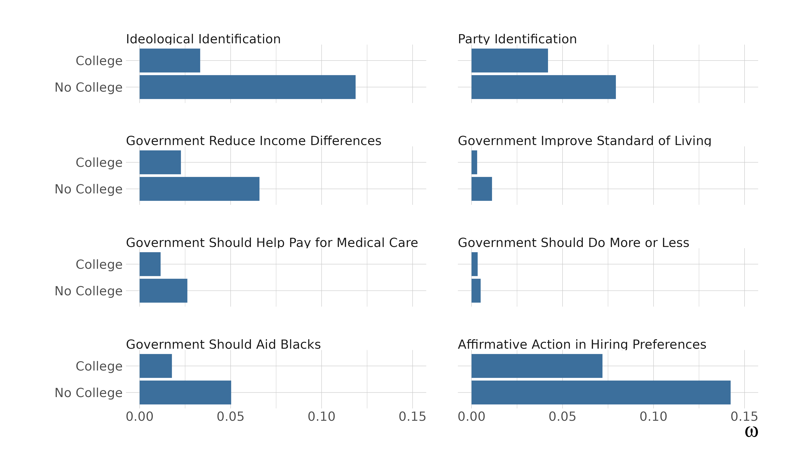

```{r setup, include=FALSE}
knitr::opts_chunk$set(echo = F, message = F, warning = F)
```

# Introduction

Does personal culture---an individual's attitudes, beliefs, values, and practices---change over the life course, or is it largely fixed by adulthood? This question underlies an important contemporary debate in sociology [@lizardo2017; @kiley2020; @lersch2023] and has deep roots in seemingly contradictory theoretical perspectives. For example, pragmatist theories of action claim that changes in social environments cause people to adapt their views and make new cultural meanings [@swidler2001; @gross2009], while Bourdieusian practice theories argue that the "past conditions of production" leave a mark on people's personal culture that lasts throughout their lives [@bourdieu1990]. Models of social influence assume that people adapt their culture in the face of new information [@goldberg2018], while the emphasis on cohort effects in models of aggregate social and cultural change requires them to be open to change while young but become fairly resistant to it as they age [@ryder1965]. Finally, life course theories posit important changes over time as people advance through important transitions in their lives [@elder2003; @bardi2009].

Because all of these theoretical perspectives have some empirical support, the current debate is not about whether their posited processes exist at all, but about their relative contribution to explaining the cultural differences we see in the world. That said, scholars have struggled to reach a consensus on the importance of change during adulthood. Over the span of a few years, most apparent changes in people's responses to personal survey items appear to be transitory, with little evidence of persistent change among adults [@kiley2020; @vaisey2021]. This suggests that change during adulthood is not a major factor in explaining personal cultural differences. When we consider a longer time horizon, however, there is evidence that adults make at least some persistent changes [@lersch2023].

These seemingly inconsistent findings are partly due to the fact that researchers have taken a "tournament of models" approach to adjudicating different theoretical perspectives [@lersch2023: p. 228]. That is, researchers have compared the fit of different statistical models to each item to determine whether it is more consistent with "no change" or "any change." The size of these piles then serves as the primary evidence for the truth of the theory [@kiley2020; @vaisey2021; @lersch2023].

We argue, however, that asking *whether* people change on an item may cause more problems than it solves. Being able to detect *any* change on an item depends not only on sample populations, measurement, statistical methods, and power, but also on definitions of what counts as "change." These differences can limit the possibility of agreement on which "pile" a variable belongs in. Moreover, asking whether there is evidence of change reduces to, "Is there *any* evidence of change in this item?" But such binary inquiries are ill-suited to address the core of the theoretical debate: determining *how much* the process of intrapersonal change contributes to cultural differences.

There is enough evidence to assert that neither pre-adult socialization nor the contemporary social context alone can explain the full range of cultural differences. The question that remains is about the *relative* contributions of these processes. In the current debate, for a single construct (e.g., support for gay rights), existing approaches can only make claims about *whether* intrapersonal change is happening, not about how much. This also prevents investigating under what conditions, across which groups, and in what domains do we see differences in the relative importance of intrapersonal change and pre-existing interpersonal differences. These questions are about *degree*, not existence; taking this debate forward will require precise measurement rather than declarations of victory for a particular perspective.

In this paper, we move beyond the "tournament of models" approach and introduce a method for quantifying the relative contributions of interpersonal differences and intrapersonal change for a single item. Drawing on seven panel data sets from five countries, we quantify the amount of variance in survey responses that is due to between-person differences at a single point during the survey versus the amount of variance in responses that is due to systematic intrapersonal change over the study period. This measure quantifies the amount of change over the duration of the panel relative to the stable differences that exist between people.

Using this measure, we observe similar patterns across the datasets that have previously yielded conflicting interpretations. In all datasets---despite their varied social contexts and duration---we find a similar distribution of intrapersonal change. In general, we find that intrapersonal change accounts for a substantially smaller amount of variance in personal culture survey item than stable interpersonal differences. Of course, whether the amount of intrapersonal change in an item is large enough to be "meaningful" is a substantive and theoretical question. Nevertheless, on many measures of personal culture (some observed for over a decade), we do not observe enough intrapersonal change for it to play a substantial role in explaining the differences we observe between adults. Notable, interesting, and important exceptions exist, of course, but they are departures from the overall pattern.

In addition to advancing a theoretical debate, our method can also help address substantive questions. To illustrate how it might be used by a researcher with a specific topical interest, we investigate differences in the relative importance of intrapersonal change for people with and without a college degree. We find a smaller amount of systematic change among college-educated respondents, suggesting that college solidifies one's personal culture rather than fostering an openness to new information. This offers a novel empirical basis to theorize about the role of university education in shaping personal culture.

Taken together, to goal of this paper is to advance---and, hopefully, transcend---debates about *whether* adults change. People do change, at least a little, on most things. Our method can help quantify exactly how much.

# Background

## Change and Stability in Personal Culture

Recent debates about whether adults undergo intrapersonal cultural change emerged in part because theories of cultural change at the aggregate level tend to implicitly invoke one of two models of individual behavior. The first, what Kiley and Vaisey [-@kiley2020] call a "Settled Dispositions Model" (SDM), assumes that peoples' personal culture is relatively fixed by the time they are adults. While they might make temporary changes in their declarative culture in reaction to their environments, this model assumes that people return to a settled baseline over a short period of time. This model underlies theories of cultural change that suggest people are imprinted by early socialization experiences such as the "past conditions of production" a Bourdieusian practice theory [@bourdieu1990], cohort replacement theories of aggregate change [@mannheim1952; @ryder1965], and control theories in social psychology [@smith-lovin1988; @robinson2007].

The second model summarized by Kiley and Vaisey [-@kiley2020], an "Active Updating Model" (AUM), posits that people continually update their personal culture as they move through life. This model suggests people change their personal culture as they adapt and make new meanings when encountering new social environments, discourses, and information [@gross2009; @swidler2001]. This model underlies, among others, theories of cultural diffusion [@christakis2010], attitude alignment [@dellaposta2020], and polarization [@bail2018]. It is also implicit in most studies that ask whether specific experiences, changes in social roles, or political events, affect personal culture [@gelman2021; @visser2004; @slothuus2021].

There is no reason to believe that only one of these two models is "correct" at all times and in all places. A population observed over some period of time contains a mix of people who are noticeably changing and people who are not. Instead, different perspectives argue that each of these ideal-typical models is more operative at different times, for different people, and for different elements of personal culture. For example, adolescence and early adulthood is typically viewed as a "formative period" for personal cultural development and thus characterized by higher rates of active updating, while middle age and later life are potentially characterized more by settled dispositions [@alwin1991; @krosnick1989; @eaton2009]. Similarly, salient issues, such as views around gay rights in the 2010s; issues that see substantial elite realignments, such as views around the Vietnam conflict in the 1970s [@zaller1992]; and novel issues of public opinion, such as views around vaccines during the Covid-19 pandemic [@scoville2022], might be characterized by active updating, while established issues of low salience are characterized by stability.

Empirically comparing which of these models better fit a broad range of questions from the General Social Survey's rotating panels, Kiley and Vaisey [-@kiley2020] found limited evidence of durable change. While the majority of items preferred the AUM, the amount of durable change detected on these items was small. A substantial minority of questions (39 percent) favored the SDM, meaning they showed no evidence of durable change. Questions with more evidence of durable change included salient issues like gay marriage and questions tapping "public" statements or behaviors such as partisan identification and religious service attendance. There was also more evidence of durable change among early adults (people ages 18-30) than the rest of the population. Overall, the researchers concluded that "results ultimately suggest that real, persistent attitude change is an uncommon phenomenon among adults'' [@kiley2020: p. 500; see also @vaisey2021]. This lack of durable change is consistent with other recent findings that cohort replacement plays a larger role than period effects in explaining differences in personal culture [@vaisey2016].

On the other hand, the claim that change is a relatively infrequent phenomenon has been difficult to square with research identifying durable change as a result of social experiences across a number of cultural dimensions, such as morality [@brocic2021], trust [@mewes2021], and concerns about immigration [@kratz2021]. Similarly, there are longitudinal studies showing that cues from political elites can change an individual's position on specific policy issues [@slothuus2021; @zaller1992] and that changes in their close contacts and acquaintances can change individuals' attitudes on group-related politics [@gelman2021; @dellaposta2018]. Given how often we observe people change their personal culture, it is hard to accept that adults do not change.

Drawing on these findings, Lersch [-@lersch2023] challenged the SDM and AUM as a "needless dichotomy," proposing the "Life Course Adaption Model" (LCAM) as an alternative. This model draws on the life course perspective to model personal culture as a different linear trajectory over the duration of a panel for each respondent. In doing this, Lersch rectified two shortcomings of the AUM and SDM. First, the AUM, as described by Kiley and Vaisey, posits that changes follow a Markov process where responses at time $t$ are a function of responses at time $t-1$ but not earlier time points. However, earlier life experiences can (directly and indirectly) mold personal culture when transitioning to new social roles or into new environments, even if their initial impact is delayed. For example, childhood events might influence views on family structures later when individuals form their own families. Therefore, the LCAM considers influences from earlier than just $t-1$ on responses at time $t$.

Second, Kiley and Vaisey's analysis of the AUM and SDM is based on three-wave panel data over four years, which might not be extensive enough to adjudicate the two models. Lersch evaluates the LCAM against the AUM and SDM using panel data spanning a wider duration (from 3 to 36 years) and more waves (3 to 18), offering a better chance to observe durable change.

When Lersch compared the LCAM to the AUM and SDM on data from five countries, 297 of the 428 questions he analyzed preferred the LCAM, suggesting that we observe some linear change for adults on most items. The SDM was preferred on 112 items, and the rest did not yield conclusive results. No questions favored the AUM. He concludes that "new experiences over the life course [...] can persistently move individuals' personal culture in novel directions" [@lersch2023: p. 243-244].

Despite differences in how these researchers interpret their findings, the empirical results are not far apart. Kiley and Vaisey [-@kiley2020] found that the majority of items they tested favored the AUM, meaning there was evidence of durable change among adults, a pattern consistent with Lersch's results. While Lersch [-@lersch2023] found evidence of durable change on most items, this change only accounted for a small proportion of variance explained. On average, people changed only about .07 standard deviations over 10 years. This is consistent with Kiley and Vaisey's finding that durable change is often small. And a quarter of the items Lersch studied still preferred the SDM, suggesting that even with different assumptions assumptions about change and more extensive data, many questions show no evidence of durable change. Likewise, in studies showing evidence of durable change in specific measures of personal culture, the change is often small. For example, Brocic and Miles [-@brocic2021] estimate that completing graduate degrees in humanities, arts, and social sciences shift peoples' moral relativism only about .2 standard deviations on average compared to people with no college degree, and this is the largest effect they identify. And studies of aggregate change show that, even on items where cohort effects explain more variance than period effects, there is always evidence that some people change over time [@vaisey2016]. In other words, despite different interpretations, the results of previous work are in many ways highly consonant.

## Quantification, Not Adjudication

The current debate can be simplified to asking whether people *ever* change. This is rarely theoretically interesting since the answer is almost always "yes." Over sufficient time and in a large enough sample, researchers will likely observe some evidence for durable individual change. A lack of evidence for change may be due to a poor survey question, a low resolution in response options, or that the question simply was not asked for long enough or to enough people. Conversely, finding evidence for some change tells us only that it was "not zero." From that alone, we learn little about how much change has happened in a population.

A more theoretically productive approach begins with a model assuming that during an observed time period people might remain stable, might change a little, or might undergo significant shifts in their personal culture. Lersch's LCAM does this by modeling each individual as following their own linear trajectory. But rather than debating whether this model fits a particular data set better than a model that assumes that people never change, researchers should quantify these individual changes and compare those to the differences that exist between people at the panel's start. In other words, the focus should shift from asking, "do people change?" to asking, "what are the relative contributions of change and initial differences for explaining differences in personal culture?"

In this approach, there are two metrics that each reflect a combination of relevant theoretical processes. The first metric, interpersonal differences at the start of the survey, reflects the accumulated experiences of people prior to entering the panel survey that shape how they answer questions. Lersch calls this "early imprinting." While commonly associated with experiences during a formative period that result in settled dispositions, this variation could also reflect experiences that happen at any stage in life as long as they predate the panel and consistently affect subsequent responses. For instance, for those people entering the panel post-retirement, this "imprinting" might reflect this pivotal life transition. Consequently, this metric also reflects variation in individuals' social roles or statuses at the start of the panel that were important in shaping their dispositions.

The second metric, the amount of intrapersonal linear change people make during the panel, captures durable changes in personal culture over time, a set of processes collectively called "persistent change" or "adaption" by Lersch and "active updating" by Kiley and Vaisey. Lersch attributes these changes to social triggers such as moving into a new environment or adopting new social roles (although he never measures them directly). Additionally, they might reflect the diffusion of new cultural forms across social networks, cues from political elites or otherwise culturally influential leaders, the emergence of issues in politics or culture, or large-scale social shifts.

A third metric, often called "residual variance" or "fluctuation," accounts for the remainder of variance in peoples' responses. This non-durable change emerges for a variety of reasons. For example, people might not have clear a clear disposition on a particular item as it is asked. Instead, they might internalize a broad set of considerations and construct an opinion in the context of the survey interview, with different considerations coming to the forefront of their cognition each interview [@tourangeau2000; @zaller1992; @feldman1992]. Additionally, this variance can also include measurement error, such as misinterpreted questions, erroneous response selections, or responses getting coded incorrectly. While this third metric at least partially reflects important processes of personal culture, it does not directly touch on the ongoing debate outlined here. Because of this we quantify this component but focus principally on the other two.

At a theoretical level, the coexistence of the sets of processes captured in the two main metrics, interpersonal differences and intrapersonal change, is undeniable, and they are linked in many ways. Any intrapersonal change during one's life will likely manifest as interpersonal differences by the time people enter a panel survey. Furthermore, unless people are entirely socialized early on and never deviate from these dispositions, we expect observing intrapersonal change in a segment of the population when surveyed over time.

Furthermore, these metrics are not necessarily useful in isolation or without context. What is important for the theoretical debate is the relative contribution of these two components in explaining cultural differences in a population. In other words, when we look at a population of adults over some time frame, is there enough intrapersonal change relative to interpersonal difference to view it as an important explanation for why people differ from each other? Only through quantifying the two processes we can get closer to a true answer to this question.

Yet the true utility of the proposed quantification goes beyond settling past debates; it allows researchers to ask questions that were difficult to explore with previous approaches. For example, classifying survey items based on whether they show durable change overlooks possibly important differences among those that do. By quantifying the relative contributions of interpersonal differences and intrapersonal change, researchers can gauge their relative importance in explaining differences among survey items, between groups within a given population, across time, and across societies.

## Expectations

By shifting the question and adjusting the approach, we expect consistent patterns across datasets previously analysed in the debate. First, because previous work found evidence of durable change on most measures of personal culture, we expect that intrapersonal change will have some explanatory power for most items. But because these earlier studies also found many questions (between 25 and 35 percent) lacking evidence of durable change, we expect considerable variation in the variance explained by intrapersonal change, with some questions indicating essentially no variance attributable to such change.

Second, we expect the variance explained by intrapersonal change to be modest compared to interpersonal differences at the start of the survey. This expectation should be uncontroversial, regardless of the theoretical process assumed to be most relevant for a particular question. Panel surveys do not encompass individuals' entire lifetimes. Thus, even if intrapersonal change during adulthood is the major driver of cultural differences, the change detected in a panel covering 20 years probably will not fully account for the entire variance of interpersonal differences.

Our expectations so far largely echo what was observed in previous studies. However, theoretical perspectives differ in how much variance they would expect to be driven by intrapersonal change, enabling quantification to provide a new perspective on existing questions. "Formative period" and cohort theories, which emphasize early-life socialization as a strong force in shaping adult personal culture, suggest that the variance from intrapersonal change would still fall short of explaining interpersonal differences, even when we account for the duration of observation. Conversely, other theoretical perspectives emphasizing the importance of people's contemporaneous social environment for personal culture expect intrapersonal change to account for a large portion of the variance, regardless of the duration.

Third, we expect the variance explained by each process ---interpersonal differences and intrapersonal change--- to depend on specific attributes of the question and panel. First, the higher the response resolution for a given question and the larger the sample, the greater the variance explained by intrapersonal change should be, as smaller changes in intrapersonal change will be easier to detect. Second, the LCAM and various theoretical perspectives that underlie it posit that social transitions drive changes in personal culture. Since the probability that any person experiences such a transition goes up the longer we observe them, we expect panel duration to be positively related to the proportion of variation explained by intrapersonal change.

# Analytic Strategy

## Data

We use data from 7 nationally representative panel surveys from Australia, Germany, Great Britain, Switzerland, and the United States (summarized in Table 1), combining all the data files used in previous work [@kiley2020; @lersch2023].[^1] These studies cover a long period of time (the range of surveys spans from 1968 to 2021), with 609 personal culture items that capture attitudes, beliefs, values, self-assessments, self-descriptions, and behaviors [@alwin2007]. We restricted the sample such that individuals between the ages of 18 and 79 are included without further elimination, and in all surveys, we used all possible cases for which respondents provided responses. In the end, the analyses that follow rely on a cross-cultural sample with a cross-domain set of items to capture a broad range of individual personal culture. Supplemental Materials A documents the list of all variables used in the upcoming analyses.

[^1]: For more information on these data sources, see [@data_gss; @data_hilda; @data_bhps; @data_ukhls; @data_soep; @data_shp; @data_psid].

```{r, message = FALSE}

library(tidyverse)
library(knitr)
library(kableExtra)

table <- tibble(
  Country = c("Australia", "Germany", "Great Britian", "Great Britian", "Switzerland", "United States", "United States"),
  Survey = c("Household, Income and Labor Dynamics in Australia (HILDA)",
             "Socio-Economic Panel Study (SOEP)",
             "British Household Panel Survey (BHPS)",
             "Understanding Society/UK Household Longitudinal Study (UKHLS)",
             "Swiss Household Panel (SHP)",
             "General Social Survey (GSS)",
             "Panel Study of Income Dynamics (PSID)"),
  Period = c("2001-2021", "1984-2020", "1991-2008", "2009-2020", "1999-2019", "2006-2012", "1968-2019"),
  Outcomes = c(30, 122, 83, 66, 77, 183, 48)
)

kableExtra::kable(table,
                  booktabs = TRUE,
                  format = "latex",
                  align = "llcc",
                  caption = "The Description of the Data Sources") |> 
  kable_styling(latex_options = c("scale_down", "HOLD_position"))

```

## Life Course Adaption Model

We start with Lersch's [-@lersch2023] Life Course Adaption Model, which formalizes survey responses at time $t$ as a function of individual-level random intercepts and slopes for survey age, what is often called a mixed-effects growth curve model. This model formally assumes a set of propositions about change that reflect the theoretical debate to this point. First, consistent with the settled disposition model, it assumes that people start the survey with cultural differences, modeled as random intercepts for each respondent. Second, it assumes that people change over time, taking the form of random slopes for each respondent as a linear function of time. Third, it assumes that people deviate around this baseline randomly over time, reflecting "fluctuation" or short-term non-persistent change. Finally, it assumes that people draw on earlier time points in reacting to new events. Formally, this can be written as

$$
y_{i, t} = \beta_0 + u_{0, i} + \beta_{1} x_t + u_{1, i} x_{i, t} + \epsilon_{i, t}
$$ $$
u_{0,i} \sim \mathcal{N}(0,\sigma_{\mu_0}^2) \\
$$ $$
u_{1,i} \sim \mathcal{N}(0,\sigma_{u_1}^2)
$$

where $\beta_0$ is the average intercept, $u_{0, i}$ is the random intercept for individuals, $\beta_1 x_t$ is the average slope, $u_{1, i} x_{i, t}$ is the random slope for individuals, and $\epsilon_{i, t}$ is the random error term that captures transitory disturbances.

## Analysis Steps

As a first step in our analysis, we fit a LCAM to each of the 609 measures of personal culture outlined above. We then use these models to derive two measures of systematic variance that correspond to the two collections of theoretical processes outlined above: interpersonal differences at baseline and intrapersonal change over time. First, to measure the importance of interpersonal differences, we calculate the sum of the squared residuals derived from measuring each respondent at the midpoint of their age trajectory.[^2] We then divide this value by the total sum of squares and subtract it from from 1, producing a value we denote as V(D), or the proportion of variance attributable to interpersonal differences. This number is equivalent to an $R^2$ value generated by using random intercepts for all respondents. Second, we calculate the sum of squared residuals generated by additionally accounting for the age trajectory. We divide this number by the total sum of squares and subtract it from 1. We then subtract $V(D)$ from this value. This gives us a value we denote as $V(C)$, the additional proportion of variance explained by intrapersonal change.

[^2]: We use the scale midpoint, rather than the actual difference at baseline, to better capture the differences between people independent of their age trajectories.

These two numbers reflect the total systematic variance of the model that can be attributed to either differences across people or linear change over the course of the panel.[^3] Our principal outcome of interest is the proportion of systematic variance accounted for by intrapersonal change, which we calculate as

[^3]: This does not mean that other factors might not explain additional variance if they were included in the model. For example, peoples' responses about religious beliefs and participation might systematically vary by the day of the week or month in which they are surveyed. This variation is moved into the "random" or non-systematic component of the model for us.

$$
\omega = \frac{V(C)}{V(C) + V(D)}
$$

We can think of this number, $\omega$ as akin to an Intraclass Correlation Coefficient focused only on the systematic components of the model while ignoring residual variance that might be attributable to measurement error or non-persisting change [see also the variance decomposition of period and cohort by @vaisey2016]. The higher this number is, the more systematic variance in responses is attributable to intrapersonal change during the panel. The lower the number, the less intrapersonal change seems to play a large role in explaining systematic cultural differences during the panel. Moving forward, we use $\omega$ as a placeholder for *systematic variance attributable to intrapersonal change*.

Because this quotient summarizes variance and therefore has no natural referent, it is hard to say at which values we observe "a lot" of intrapersonal change. But summarizing questions in this way allows us to compare the relative importance of our two broad processes across a range of questions that might have different levels of non-systematic variance, giving us a sense of the relative prevalence of these two processes for each question (something not achievable under the tournament of models approach), and allowing us to compare which kinds of questions show more or less intrapersonal change relative to interpersonal differences. While the tournament of models approach allowed researchers to say whether questions in general showed evidence of updating, this approach allows us to make more specific claims about the prevalence of these theoretical processes for particular questions relative to each other.

As a second step in our analysis, we use ordinary least squares regression to model $\omega$ as a function of features of the question and panel. This allows us to explore how these features affect the prevalence of intrapersonal change. These covariates include the number of response options (measured as 2, 3-5, and more than 5), the panel, the log of the number of participants, the number of waves observed, the time since the question was first asked, and the total span of time the question was asked.

# Results

## Variance Decomposition

Figure 1 plots the proportion of systematic variance attributable to interpersonal differences and intrapersonal change for each of the 609 questions analyzed, plotted separately by panel. To broadly summarize the results, all panels show a similar range of the proportion of systematic variance attributable to intrapersonal change. Across panels, the median proportion of $\omega$ is 0.094 (mean of 0.098), with an interquartile range of 0.053 to 0.139. All panels include questions where $\omega$ is essentially 0, and all panels include questions with $\omega$ values greater than 0.20. The maximum $\omega$ value is 0.26.

```{=latex}
\begin{figure}[htp]
\begin{center}
\caption{Proportions of Systematic Variance in Personal Culture}
```
```{r fig1, out.width = "100%", fig.pos = "H"}

```
```{=latex}
\end{center}
\footnotesize{\textit{Notes:} The figure shows $\omega$ and 1 - $\omega$ as the proportion of systematic variance attributable to intrapersonal change and interpersonal differences. See Supplemental Materials A for the full set of item values.}
\end{figure}
```

Across all questions, interpersonal differences explain a much larger share of the systematic variance in responses than intrapersonal change. Again, this is to be expected. Interpersonal differences capture not just pre-adult socialization, but all accumulated experiences up to the start of the panel that might have a bearing on personal culture.

To the extent that there are differences across the panels, the PSID has the highest $\omega$ values with mean .120 and median .135. While we cannot disentangle features of the sample from features of the questions asked to each sample, the specific samples for many PSID questions have lower average ages than those from other panels. To the extent that younger respondents might be more likely to make durable changes of opinion, this higher explanatory power of intrapersonal change might reflect the distinct age profile of respondents in this sample. At the other end, the GSS has the lowest range of $\omega$ with mean .073 and median .069. This potentially reflects the fact that the GSS observes people for a shorter duration, on average, than the other panels. If, consistent with life course adaption theories, people are more likely to make significant cultural changes the longer we observe them, then duration likely affects the range of $\omega$ (a point we explore more below). However, the GSS results are still consistent with results from the other panels.

While there are some differences between panels, these differences are small compared to the differences within panels. For about 6 percent of items explored here, $\omega$ is greater than 0.20. These questions tend to ask about external referents (e.g., confidence in specific government leaders or political parties), life satisfaction, or current financial position. At the other end, questions about religious identification, views on gender roles, and support for civil liberties tend to have very low proportion of variance attributable to intrapersonal change.

In contrast to the tournament of models approach, quantifying change this way allows us to explore variation in the relative importance of intrapersonal change across questions that all both show evidence of change. For example, Kiley and Vaisey [-@kiley2020] found that confidence in the press and confidence in religious leaders were both characterized by active updating. Our results show that intrapersonal change is much more important for explaining variance in confidence in the press (0.164) than confidence in religion (0.049).

Supplemental Materials A presents the estimated proportion of variance attributable to interpersonal differences and intrapersonal change, the estimated values of $\omega$, and the proportion of residual variance for each question analyzed. In general, interpersonal differences are almost always the largest component of the total variance and tend to explain between 55 and 70 percent of total variance, while intrapersonal change is always the smallest, typically explaining between 3 and 8 percent of total variance. Residual variance tends to account for between 22 and 37 percent of variance, though on several questions residual variance is greater than 50 percent.

As noted above, the substantive importance of intrapersonal change for understanding cultural differences depends on a range of factors, including how long the panel runs, whether assumptions about linear change hold, and whether the panel is capturing a distinctly turbulent period or a distinctly stable period for the item under question. However, if we assume that the period under observation is "typical" for a question ---not a time of extremely heightened (or lowered) sensitivity or change--- then it does not seem realistic for this process of intrapersonal change to explain a large share of interpersonal differences for many of the questions we observe.

## Meta-Analysis

Figure 2 plots the results from an ordinary least squares regression of $\omega$ as a function of question, panel, and sample features. These models also include fixed effects for panels and topics, so coefficients reflect the association within a panel and topical domain.

```{=latex}
\begin{figure}[htp]
\begin{center}
\caption{Regression Model Estimating $\omega$}
```
```{r fig2, out.width = "450px"}

```
```{=latex}
\end{center}
\footnotesize{\textit{Notes:} The model estimates the proportion of systematic variance attributable to intrapersonal change. It includes the log of the number of participants, the number of waves the variable was asked (capped at t = 10 for each item), the date of the first wave (measured as the year minus 1968 divided by 10), number of waves the question was asked averaged across participants, duration in years per item averaged across participants, and panel and topic fixed effects. Coefficients are estimated from suppressed intercept model based on predictions at participants' wave mid-point. Survey indicators and item topics not shown. See Supplemental Materials B for the full set of coefficients.}
\end{figure}
```

Figure 2 shows that the more response options respondents are given and the larger the sample, the larger the values of $\omega$. We interpret these coefficients as suggesting greater resolution on a question makes it easier to detect and model change. The earlier a question was asked, even net of how long it was been asked, the lower the $\omega$.

While we did not generate expectations for how question content relates to $\omega$, some of the associations between question structure, panel duration, and panels themselves might be driven by differences in the topics addressed by each panel. To address this, we coded each question as falling into one of nine different content categories and included these as indicator variables in the meta analysis. Supplemental Materials B presents the estimates for these content indicators. They show some associations with $\omega$, with questions about subjective SES; social life, social cohesion, and trust; environment and climate; and health and morale showing larger $\omega$ values than questions about religion and spirituality; politics, government and the economy; and gender and family.

The most notable result in the meta analysis is the negative coefficient attached to the duration of years covered by the question. The longer a question is observed, the less is the value of $\omega$. Theories of personal cultural change that link changes in personal culture to social experiences, including the LCAM, suggest that the longer we observe respondents, the more likely people are to undergo potentially transformative experiences and therefore the more variance would be explained by intrapersonal change. The fact that we find a negative coefficient attached to this variable can be a challenge to that assumption.

As a further test of this coefficient, we compared the $\omega$ values when using the full duration of a panel compared to when we dropped the final wave and therefore reduced the total duration of observation for the question. If the coefficient reflects a true negative effect of duration on $\omega$, we should see that same effect within questions. Results from this analysis are presented in Supplemental Materials C and contradict the coefficient from the regression model: we found that the longer we observe the same question, the higher the $\omega$ is. We interpret this combination of findings as suggesting that the kinds of questions asked for a longer time period tend to demonstrate less intrapersonal change than questions asked over shorter periods, rather than a true function of time. This reinforces the explanation for why the GSS displays the lowest average proportion of systematic variance attributable to intrapersonal change: its shorter duration.

## College and Change in Political Culture

These results mostly re-frame and align previous findings, but the value of our approach lies in its ability to extend the debate to a broader set of theoretical questions. To show this potential, we turn to a specific empirical example: the relative importance of intrapersonal change and interpersonal difference for explaining cultural variation by education levels.

Previous work has established a positive relationship between education and attitude stability, especially on issues related to American politics. This stability is often attributed to education facilitating "chronic information" -- a general understanding of and attention to the domain of American politics, including the positions held by major parties and political figures and how issues relate to one another at a logical or socio-logical level [@zaller1992; @alvarez2002; @boutyline2017]. These perspectives argue that because college graduates have more knowledge of American politics, they are better able to consistently connect the considerations in their cognition with the answer choices they are presented with in a survey.

This work has tended to focus on the fact that college-educated Americans give responses that are less likely to be affected by measurement error or short-term influences than the rest of the population [@zaller1992; @alwin2007]. But focus on the difference in the non-systematic or residual component of variance across groups obscures the fact that the relative importance of different components of systematic variance, intrapersonal change and interpersonal differences, might also differ across these groups.

There are theoretical reasons to believe that education might be associated with either more or less systematic variance attributable to intrapersonal change. On one hand, because college graduates are more connected to mainstream discourse and elite signals, they might be more likely to make durable changes in response to the emergence of new information, new issues, or political realignments, while those without chronic information display more variance around their baselines without their baselines changing much [@zaller1992]. In contrast, it could be the case that the stability demonstrated by educated respondents reflects the fact that they have already formed durable opinions and are relatively closed off to new information. In this perspective, college could serve as a formative experience that solidifies some dimensions of personal culture for people who attend. But among people who do not attend college, later life experiences might prove more important in forming or changing personal culture, as these experiences potentially provide information that college-educated peers received earlier.

To test these competing propositions, we use the models presented above to separately calculate $\omega$ values for people with at least a bachelor's degree and people with less than a bachelor's degree at wave 1[^4] of the General Social Survey's panels. We focus on the GSS because it contains the largest number of questions tapping general political dispositions, which is the domain where education has proven particularly relevant for understanding attitude stability. The GSS also covers a turbulent window of American politics from 2006 to 2014. This window covers the start of the Great Recession, debates about federal intervention in and regulation of Wall Street, the election of Barack Obama as the first black president in U.S. history, debates about the role of the federal government in the health care sector, the emergence of the Tea Party, and political realignment and clarification on the issue of gay marriage, among other topics.

[^4]: A small number of respondents report different highest degrees at wave 1, wave 2, and wave 3. Some of this is due to measurement error, and some of it is due to a small number of people obtaining a higher degree during the four years of the panel. Estimating the panel with highest at wave 1 or highest degree reported across the panel produces functionally identical results.

Figure 3 plots the distribution of differences in $\omega$ values between people with at least a bachelor's degree and people with less than a bachelor's degree at wave 1 of the panel for all 183 GSS items we explored. Values greater than 0 indicate that intrapersonal change is more important in explaining the responses of college graduates than those of people without a college degree, while values less than 0 indicate that intrapersonal change is less important for explaining variation among people with a college degree than those without a college degree.

```{=latex}
\begin{figure}[hbt]
\begin{center}
\caption{Difference in $\omega$ Across College Graduates and Non-Graduates}
```
```{r fig3, out.width = "450px"}

```

```{=latex}
\end{center}
\footnotesize{\textit{Notes:} The figure shows the difference in $\omega$ values across college graduates and college non-graduates. Values above (below) 0 means that those with college degree have higher (lower) variance of intrapersonal change. The dashed red line marks 0 difference.}
\end{figure}
```

There is a clear pattern in Figure 3: for more than 80 percent of GSS items explored here, intrapersonal change is a larger component of systematic variance for people without a college degree than for people with a college degree (i.e., the difference is negative). While most of these differences are small in absolute terms, less than 2 percentage points, several are greater than 5 percentage points. Given the distribution observed in Figure 1 showing that the systematic variance attributable to intrapersonal change averages around 0.09, a 5 percentage point difference between groups is quite substantial.

To more clearly illustrate some of these differences, we highlight eight questions designed to tap general political dispositions: partisan identification (Democrat vs. Republican) and ideological identification (liberal vs. conservative) on seven-point scales; four questions about the government's role in improving the condition of the poor, paying people's medical bills, giving special treatment to black people, and doing things that private businesses could do, measured on five-point scales; a question about whether the government should do more to reduce income differences, measured on a seven-point scale; and one question about whether black people should be given preferences in hiring, measured on a five-point scale. Estimates of $\omega$ for these eight questions, for both education groups, are presented in Figure 4.

```{=latex}
\begin{figure}[hbt]
\begin{center}
\caption{Difference in $\omega$ Across College Graduates and Non-Graduates on Political Culture}
```
```{r fig4, out.width = "450px"}

```

```{=latex}
\end{center}
\footnotesize{\textit{Notes:} $\omega$ values across college graduates and college non-graduates on 8 political culture items from the General Social Survey (2006-2014).}
\end{figure}
```

On all eight questions presented in Figure 4, $\omega$ values are greater for people without a college degree than for people with a college degree, meaning intrapersonal change explains less systematic variance for people with a college degree than for people without one. There are also large differences in $\omega$ values across questions for both groups. For example, on the question of whether the government should try to solve more problems or leave those problems to be solved by private businesses ("government do more or less"), less than one percent of the systematic variance is attributable to intrapersonal change for both groups. In other words, while people might vacillate on this question at random (37 percent of variance is residual for this question), there is functionally no evidence that people make systematic changes of opinion on this issue during the GSS panel.

In contrast, partisan identification and political ideology both show larger values of $\omega$ than most other questions, as well as a larger absolute difference between people with a college degree and those without. Compared to the other questions explored here, change as adults plays a much larger role in explaining why people report the partisan identification and political ideology they do. And this is particularly true for respondents who do not have a college degree. The $\omega$ value for ideological identification among non-college educated respondents is almost four times that of college-educated respondents.

We note here that this meaningful difference in $\omega$ values across education groups and across questions would not be detectable using previous methods. For partisan identification and political ideology, both college-educated respondents and people with less than college degree would likely favor the AUM or LCAM over the SDM because they these questions both show evidence of some members of the population making intrapersonal change. In other words, using the tournament of models approach obscures the fact that the relative importance of intrapersonal change in explaining differences on these two items is different across these two groups, that intrapersonal change explains more systematic variance for ideological identification than partisan identification for people without a college degree, and that there appears to be more durable change on questions of affirmative action than on questions of government aid to black Americans.

We believe these patterns shed new light on the mechanisms underlying differences in attitude behavior across groups. Something about college attendance limits the ability of experiences later in life to drive changes in personal culture. While these results should not be interpreted as causal effects of attending college -- they are potentially confounded by age, social class, race, gender, and other factors that explain selection into higher education -- they open up a set of new questions and dynamics to explore.

# Discussion

This paper set out intervene in the debate on whether people change their personal culture -- their attitudes, beliefs, values, practices, and dispositions -- as they move through their adult life. Instead of falling back on a "tournament of models" approach [@lersch2023: p. 228] to proclaim victory for only one answer to this question, it seeks to refocus the debate to the theoretically more productive question of the relative importance of intrapersonal change for explaining differences in the personal culture. It proposes a new approach that quantifies the amount of observed systematic variance that is attributable to either interpersonal differences at baseline or intrapersonal change over the duration of a panel.

Applying our proposed measure, $\omega$, to all questions about personal culture from the panel datasets previously discussed in this debate revealed a consistent pattern. Nearly all questions show evidence of people making durable, intrapersonal change over time, with some showing notably high intrapersonal change compared to interpersonal differences. For some questions about factors that affect one's life satisfaction or views on government benefits, it seems plausible that differences in adult experiences predominantly account for the observed differences between people.

However, intrapersonal change is often substantially less pronounced than interpersonal differences, accounting for less than 10 percent of systematic variance on average across all datasets. On numerous questions, like those on civil liberties, abortion, generalized trust, and civic duty, the systematic variance attributable to intrapersonal change is essentially zero. For these questions, it seems there is not enough cultural change during adulthood to warrant attributing differences in personal culture mainly to experiences and social transitions; instead, the primary source of the observed differences appears to stem from experiences in childhood, adolescence, and early adulthood.

More than adjudicating past positions in this debate, the approach presented in this paper enables scholars to more clearly explore the relative contributions of change and stability in explaining variation in personal culture, as well as how these contributions might differ across populations. To exemplify this, we detailed how amount of cultural difference explained by intrapersonal change varies substantially by survey item but also by individuals' characteristics such as their education. Intrapersonal change plays almost no part in explaining sentiments regarding the government's economic role, but it is more defining for ideological and partisan identities. Intriguingly, it is more important in explaining cultural variation among non-college graduates compared to college graduates in the United States. While age and other factors related to college completion might confound this pattern, it suggests that college completion may solidify personal culture to an extent that renders the effect of other adult experiences on political dispositions less influential for college graduates relative to non-college graduates.

## Implications for Cultural Sociology

Sociologists interested in understanding cultural differences have largely asked about the presence and significance of cultural change in adults [e.g., @kiley2020; @vaisey2021; @lersch2023]. Yet doing so has unnecessarily limited and might even set the wrong focus. In any population, some degree of cultural change in adults is inevitable. Likewise, no viable theoretical perspective would expect just one process -- stable differences or internal change -- to shape their personal culture. Our results reinforce this point, showing the relevance of both interpersonal differences and intrapersonal change in understanding the differences in personal culture among adults across all items analyzed.

This and other recent findings [@stewart2023; @quinn2023] suggest that it is theoretically more productive to ask about the relative importance of these two processes in understanding cultural variation. Drawing a unified conclusion from survey items measuring various cultural forms on different scales and across different time frames is challenging. However, the general pattern suggests that, for most items, intrapersonal change in adulthood is not the primary reason for cultural differences among people.

To clarify, our findings do not imply that adults remain static or that their changes are inconsequential. Even minor shifts in personal culture, such as a 2 percentage-point change in support for gay marriage, can have significant ramifications. While the majority may remain consistent in their views, understanding the underlying mechanisms of even such minor shifts remains a crucial task for the sociology of culture.

Our findings primarily suggest that understanding variations in personal culture requires scholars to examine the conditions and experiences of early life. While transitions between social roles, changes in social networks, and the experience of organizational environments are often emphasized in sociological research, these factors seem to account for a smaller proportion of differences among adults than the formative experiences early in life.

This conclusion aligns with a range of recent causal inference work suggesting that selection effects, rather than treatment effects, predominantly account for personal cultural differences among individuals in varied social roles and positions [@campbell2016; @wodtke2018]. While some people clearly change as they transition into new roles or environments, this change often seems to be insufficient in magnitude and duration to explain what are often pronounced differences among people in diverse roles. These and our results suggest that when observing differences in personal culture across social roles, such as parenthood, education, or professional authority [@longest2013], or across occupations [@weeden2005], selection likely plays a large role in explaining these difference, though exceptions always exist.

Our analysis does not provide an answer as to why intrapersonal change seems to have limited impact on understanding cultural differences among adults. The situations that promote durable change in personal culture might simply be rare during adulthood. Alternatively, it is possible that adults do encounter opportunities, necessities, and incentives for change, but their ability or willingness to change decreases. All the more it is important to research when and how social situations can provoke durable change in adults.

Related to this, our results regarding education and political views suggest that the importance of processes that lead to such change can vary by group. Aligning with life course theories, it seems the significance of experiences for cultural change may be contingent on other, prior experiences. For example, factors that shape cultural dispositions may likely differ for college and non-college graduates; the latter might be more profoundly influenced by mid-life experiences than the former in this regard. In trying to understand differences in personal culture, sociologists should therefore pay more attention to the heterogeneous effects that various factors including social events, encounters, and situations can have.

Our findings also have implications for understanding cultural change at the aggregate level. Given that intrapersonal change does not appear as the primary driver for many cultural differences among adults, our results suggest that many forms of cultural change at the aggregate level are more likely driven by processes of cohort replacement than the by contemporaneous social conditions changing people's cultural dispositions [@vaisey2016; @underwood2022]. This likely holds true for cultural change at the macro societal level as well as the micro level such as within organizations, political parties, and professions. Our findings also indicate that the impact of formative experiences, as opposed to contemporaneous social factors, on cultural change is contingent upon an individuals' level of education. The weight of these two factors might thus change as the prominence of education shifts in the life course. If scholars find similar differences across other social categorizations like class or race, it would advocate for a more thorough integration of demographic processes into the analysis of cultural change at the aggregate level.

## Implications for Survey Research

Our findings underscore the value of extended panel surveys to advance theories of culture. On average, non-systematic fluctuations in responses account for more than four times as much variance as intrapersonal change, measured as linear change. Differentiating between the two is therefore crucial for understanding cultural differences and cannot be done with cross-sectional data. Instead we should extend panels beyond two waves to gain more leverage to understand when and in what form personal culture changes.

Further, we align with others [**WE NEED SOME CITES HERE**] advocating for more studies --including panel studies-- focusing on the socialization of youth. Our analysis points to the majority of variance among adults rooting in differences encountered before turning 18. By empirically constraining their analysis to experiences after that point, social scientists may inadvertently concentrate on topics and questions that, while important, might not be able to help explain major cultural differences in adult populations.

Finally, a key insight from our meta-analysis is that an increase in response resolution --the range of response options survey respondents are given-- correlates with an increased share of systematic variance explained by intrapersonal change. This may reflect specific issues being assessed by survey items using different scales. Alternatively, it might imply that when intrapersonal changes occurs, they are often subtle with answers moving from "agree" to "strongly agree," rather than from "strongly agree" to "strongly disagree." Such subtle changes require finer response options to be detected.

## Limitations

The approach outlined here generates estimates of how much of the observed variance in a population can be attributed to one of two sets of theoretical processes: intrapersonal change and interpersonal differences at baseline. It does not quantify the proportion of people who "change," nor can we be sure that the amount of interpersonal change we detect is driven by many people making small changes or a few people making large changes.

Our results and interpretations also hinge on how we have defined change. Similarly to the LCAM, our approach treats cultural trajectories as varying linear slopes for each respondent, thus assuming that change is a linear function of time. This assumption simplifies reality in which change likely also takes non-linear and discontinuous forms. People might jump from one "stable" disposition to another or experience a "turning point" in their lives that upsets an otherwise stable trajectory. In parts, our assumption of linearity is a limitation of the data, as most questions are only observed for three to six waves. Panels with more waves might allow researchers to loosen this assumption to test alternative, more flexible models of change.

Similarly, our approach assumes that durable change is unidirectional. This is a sensible assumption on short panels where classifying change that lasts less than two years as durable seems unreasonable. Practically, it means that the variance produced by people making durable changes in their cultural dispositions to then returning to a previous state later in life is classified as residual variance, rather than intrapersonal change. Longer panels and more flexible definitions of "change" would allow us to account for such trajectories and thus potentially also identify more durable change even in the same population.

Finally, we had chosen to examine the broadest array of measures of personal culture available to us, ranging from religious beliefs and core values, to policy preferences, and even to the importance of different features when buying a new car across five countries (Australia, Germany, Switzerland, the United Kingdom and the United States). Nevertheless, our findings remain limited to the kinds of questions that are asked in panel surveys and in the contexts they were administered, reflecting issues of general (national) politics, gender roles, immigration and race relations, and general well being. Although we have no reason to believe results to be different, our findings do not directly speak to other dimensions of culture such as artistic tastes, leisure activities, and time use.

## Implications for Future Research

We believe the approach outlined here can push past the "needless dichotomy" implicit in the question of whether people change or not and address more theoretically informed questions about the conditions under which the relative importance of intrapersonal change and interpersonal differences in explaining cultural differences shifts. Characterizing questions as displaying change or not can only take researchers so far, but the question of whether some questions demonstrate more change than others, or whether some groups are characterized by more stability than others, has the potential to weigh in on a broader range of theoretical debates. We hope researchers move toward those questions.

While we focused on education as a determinant of the explanatory power of intrapersonal change, our approach can readily be extended to other socio-demographic categories that might affect intrapersonal change --race/ethnicity, religiosity, social class, gender, and political affiliation, for example-- or their intersections. Researchers with different data might be able to evaluate the relative importance of intrapersonal change and interpersonal differences across contexts as well, either national contexts if the same questions are administered across countries, or organizational contexts if data traces students within schools, workers within workplaces, or congregation members within congregations.

The wide variation across questions in the proportion of systematic variation attributable to intrapersonal change also calls for a more systematic exploration for why some forms of culture are characterized by stability while others are characterized by change, and what the consequences of these differences for the organization of beliefs in the public might be.

\theendnotes

# References

::: {#refs}
:::