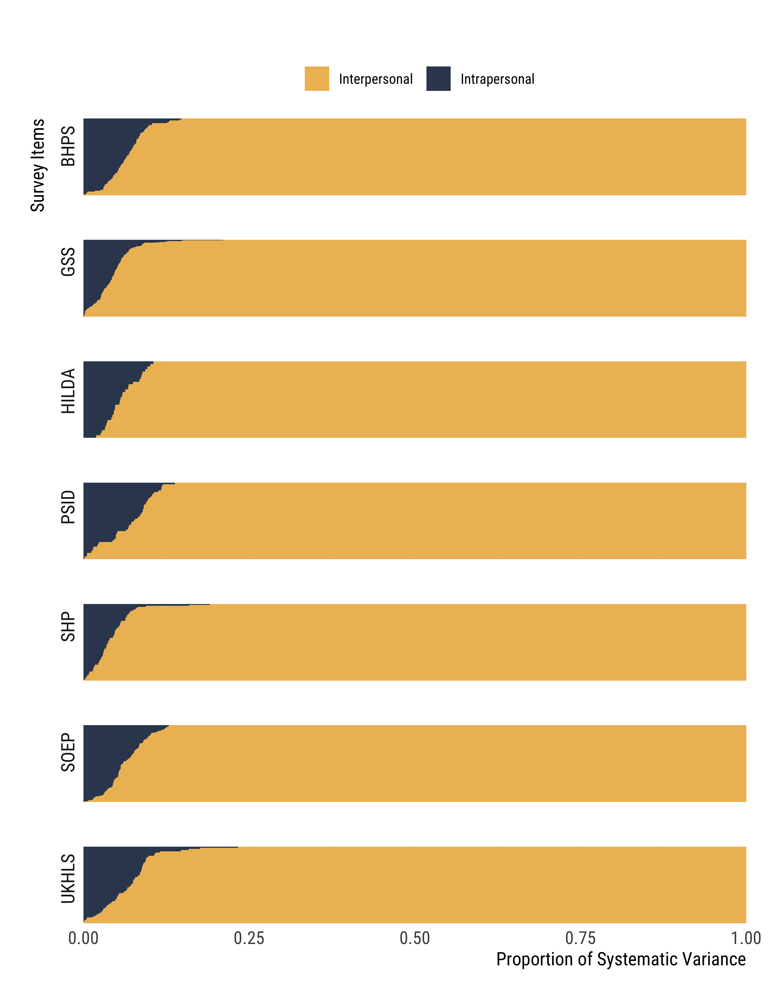

---
# basics
title: |
  | Quantifying the Importance of Change for Understanding Differences in Personal Culture
author: 
  - Achim Edelmann^[médialab, Science Po; equal authorship.]
  - Kevin Kiley^[Department of Sociology and Anthropology, North Carolina State University; equal authorship.]
  - Turgut Keskintürk^[Department of Sociology, Duke University.]
  - Isabella Bouklas^[Department of Sociology, Duke University.]
  - Stephen Vaisey^[Department of Sociology, Duke University.]

# timing
date: today
date-format: "MMMM, YYYY"

# format
format:
  pdf:
    pdf-engine: xelatex
    fig-pos: 'H'
    mainfont: "TeX Gyre Pagella"
    sansfont: "TeX Gyre Pagella"
    mathfont: "TeX Gyre Pagella Math"
    link-citations: true
fontsize: 11pt
geometry: margin=1in
numbering: true
toc: false
number-sections: false

# source
bibliography: helpers/kileybib.bib
csl: helpers/asa.csl

# abstract
abstract: | 
  | Studies in the sociology of culture have converged on a general conclusion that while people sometimes make substantial shifts in their personal culture over time, most elements of personal culture are characterized by low rates of persistent change during adulthood. Recent developments have begun to quantify change over time and initial differences, but it is unclear how to use these components to understand the relative importance of change, especially when change is modeled non-linearly. To advance this debate, we introduce a measure for quantifying the proportion of systematic variance in panel data attributable to intrapersonal change. Applying this measure to 610 items from seven surveys in five countries, we find that although intrapersonal change is common, it does not explain a large share of systematic variance.
  |
  | \textcolor{red}{\textbf{Disclaimer}: This is no longer a working paper, and the article will not be revised or submitted for publication. We provide the final version of the article below for scientific record. We believe that the formal properties of our proposed measure are well-suited only to a narrow class of problems and do not generalize to many empirical settings in which it might otherwise be applied. Researchers should therefore treat our work as exploratory. Our code is presented at \url{github.com/krkiley/quantifying_change.}}

# latex notes
header-includes:
- \usepackage{array}
- \usepackage{longtable}
- \usepackage{booktabs}
- \usepackage{float}
- \usepackage{caption}
- \usepackage{amsmath}
- \usepackage{setspace}
- \usepackage{xcolor}
- \usepackage{hyperref}
- \captionsetup{justification=raggedright,singlelinecheck=false}
- \brokenpenalty=0
- \clubpenalty=0
- \widowpenalty=0
---

\doublespacing
\newpage

An important contemporary debate in sociology centers on the importance of individual change over time for understanding differences in "personal culture"---beliefs, preferences, and practices [@lizardo2017; @kiley2020; @lersch2023; @underwood2022; @vaisey2016]. This question has strong roots in seemingly contradictory theoretical perspectives. For example, pragmatist theories claim that changes in social environments cause people to adapt their views and make new cultural meanings [@swidler2001; @gross2009], while Bourdieusian practice theories argue that the "past conditions of production" leave a mark on people's personal culture that lasts throughout their lives [@bourdieu1990]. Models of social influence assume that people adapt their culture in the face of new information [@goldberg2018], while the emphasis on cohort effects in models of aggregate cultural change requires them to be open to change while young but become fairly resistant to it as they age [@ryder1965]. Finally, life course theories posit important changes as people advance through important transitions, but that certain life stages have more lasting influence than others [@elder2003; @bardi2009].

Recent work on this topic has converged on a general conclusion that people do sometimes make substantial shifts in their personal culture over time but that most elements of personal culture are characterized by low rates of persistent change during adulthood [@kiley2020; @lersch2023]. Work leading to this conclusion adopted a "tournament of models" approach to adjudicating different theoretical perspectives [@lersch2023, p. 228]. In this framework, researchers formalized different models of change over time and relied on model selection criteria---primarily the Bayesian Information Criterion [@raftery1995]---to classify different questions as demonstrating either "no change" or "any change." The size of these piles then serves as the primary evidence for the truth of different theoretical arguments [@kiley2020; @vaisey2021; @lersch2023].

However, as consensus emerges, researchers are now turning toward understanding the conditions that produce persistent change in personal culture, including age, education, and life-course transitions; whether certain kinds of people are more likely to make persistent changes in personal culture; and whether certain kinds of personal culture are more likely to be characterized by persistent change or stability. The tournament of models approach, useful for the broad question of whether change happens, is ill-suited to addressing these more theoretically grounded questions.

In a recent paper, Lersch [-@lersch2023] advances recent debates about the importance of change for understanding personal culture [@kiley2020; @vaisey2021; @vaisey2016] by devising a *Life Course Adaption Model* (LCAM)---a mixed-effects growth curve model that quantifies various components of cultural difference: early imprinting, persistent change, biographical experience, and fluctuation. In quantifying these components of cultural difference, the LCAM lets researchers address a broader range of theoretical questions than the single question of whether a particular measure of personal culture [@lizardo2017] is characterized by over-time stability or change. However, because the LCAM produces so many different measures, it is not obvious how to use these model components to understand *the relative importance of within-person change* across items, groups, or time periods, especially when cultural change is measured in non-linear ways.

In this paper, we build on the LCAM by outlining a single metric that combines components of the LCAM to quantify the relative importance of intrapersonal change and interpersonal difference for explaining variation in a population for a variable over time. This approach seeks to isolate the systematic components of variance---i.e., it removes random change and measurement error---to provide a single summary of how much systematic variation can reasonably be attributed to people making persistent changes over time. This quantity, what we call $\omega$, can be used as a diagnostic to compare across questions, groups, or periods to isolate where within-person change is more or less useful for explaining aggregate variation in the distribution of personal culture in a population.

We demonstrate the utility of $\omega$ by estimating it across 610 items from seven panel surveys and five countries. We quantify the proportion of variance attributable to systematic intrapersonal change rather than to interpersonal differences at baseline. In doing so, we generate an overall picture of how much of the total systematic variation in personal culture change tends to explain. These findings largely echo previous findings, but enable new statements about the explanatory importance of accounting for change, rather than binary claims about whether change "happens."

# Quantifying Omega

The starting point for our quantity $\omega$ is Lersch's [-@lersch2023] LCAM, which formalizes survey responses at time $t$ as a function of individual-level random intercepts and slopes for survey age. This strategy is also called a mixed-effects growth curve model. This model assumes a set of propositions about change that reflect the theoretical debate at large. First, it assumes that people start the survey with cultural differences, modeled as random intercepts for each respondent. Second, it assumes that people change over time, taking the form of random slopes for each respondent as a linear function of time. Third, it assumes that people deviate around this baseline randomly over time, reflecting "fluctuation" or short-term non-persistent change. Formally, this can be written as
$$
\begin{gathered}
y_{it} = \beta_0 + \alpha_{0i} + (\beta_1 + \alpha_{1i}) \text{year}_{it} + \epsilon_{it} \\
\begin{aligned}
\alpha_{0i} &\sim \mathcal{N}(0,\tau^2_{0}) \\
\alpha_{1i} &\sim \mathcal{N}(0,\tau^2_{1}) \\
\epsilon_{it} &\sim \mathcal{N}(0,\sigma^2)
\end{aligned}
\end{gathered}
$$

where $\beta_0$ is the average intercept, $\alpha_{0i}$ is the random intercept component for individuals, $\beta_1$ is the average yearly change, $\alpha_{1i}$ is the random slope component for individuals, and $\epsilon_{it}$ is the random error that captures fluctuations. The $\alpha_{0i}$ and $\alpha_{1i}$ terms are also allowed to covary.

Using this model, we then derive two theoretically informative values for understanding personal culture: (1) pre-existing interpersonal differences and (2) intrapersonal change over time.

**_Interpersonal Differences_ V(D)**. The first component reflects the accumulated experiences of people prior to entering the panel survey. Lersch [-@lersch2023, p. 24] calls this *early imprinting*. While commonly associated with experiences during a formative period that result in settled dispositions, this variation could also reflect experiences that happened at any time as long as they predate the panel and consistently influence subsequent responses. For instance, for those people entering the panel post-retirement, this "imprinting" might reflect this pivotal life transition and its subsequent effects observed in the panel window. Consequently, this component also reflects variation in individuals' social roles or statuses at the start of the panel that were important in shaping their dispositions.

To measure interpersonal differences, we calculate $V(D)$ according to the equation below, where $\widetilde{year_i}$ is the midpoint of the observed years for each respondent for that particular item:[^2]

$$
V(D) = 1 - \frac{\sum_{i=1}^N \sum_{t=1}^T [y_{it} - (\hat{\beta}_0 + \hat{\alpha}_{0i} + (\hat{\beta}_1 + \hat{\alpha}_{1i}) \widetilde{\text{year}}_{i})]^2}{\sum_{i=1}^N \sum_{t=1}^T [y_{it} - \bar{y}_{it}]^2}
$$

[^2]: We use the model estimate from the midpoint year, rather than the value at the first wave, as this is the best measure of "baseline" available under the assumption that the person does not change. The first wave measure alone contains an unknown amount of measurement error and transient fluctuations.

This effectively models respondents' responses under the assumption that they make no systematic change over time, or that the expected value at any time point is the same as the expected value at any other. Therefore, this measure---V(D)---gives us the proportion of total variance in an item attributable to stable interpersonal differences in the population under study.

**_Intrapersonal Change_ V(C)**. The second component, the amount of intrapersonal change people make during the panel, captures persisting changes in personal culture over time. This component captures the set of processes collectively called "persistent change" or "adaption" by Lersch [-@lersch2023] and "active updating" by Kiley and Vaisey [-@kiley2020]. Lersch [-@lersch2023] attributes these changes to social triggers such as moving into a new environment or adopting new social roles (although he does not measure these directly). They might also reflect the diffusion of new cultural forms or ideas across social networks, cues from political elites or otherwise culturally influential leaders, the emergence of issues in politics or culture, or large-scale social, political, or economic shifts.

To calculate the second component, which is the variance attributable to systematic intrapersonal change, we calculate $V(C)$ as follows:

$$
V(C) = 1 - \frac{\sum_{i=1}^N \sum_{t=1}^T [y_{it} - (\hat{\beta}_0 + \hat{\alpha}_{0i} + (\hat{\beta}_1 + \hat{\alpha}_{1i}) \text{year}_{it})]^2}{\sum_{i=1}^N \sum_{t=1}^T [y_{it} - \bar{y}_{it}]^2} - V(D)
$$

This is the incremental proportion of variance accounted for when we allow the model predictions to change over time for each person, allowing us to quantify the explanatory power of change.

A third component, which we might call residual variance or "fluctuation," accounts for the remainder of variance in peoples' responses. These non-durable changes emerge for a variety of reasons. For example, people might not have a clear disposition on a particular item as it is asked. Instead, they might internalize a broad set of considerations and "construct" an opinion in the context of the survey interview, with different considerations coming to the forefront of their cognition during each interview [@tourangeau2000; @zaller1992; @feldman1992]. This variance can also include measurement error, such as misinterpreted questions, erroneous response selections, or responses getting coded incorrectly. Although this third component at least partially reflects important processes of personal culture, it does not directly touch on the ongoing debate outlined here. Hence, we quantify this component but focus principally on the other two.

Together, $V(D)$ and $V(C)$ reflect the total systematic variance of the outcome that the LCAM can attribute to either differences between people or linear intrapersonal change.[^alternatives] Our principal measure of interest is the proportion of systematic variance accounted for by intrapersonal change, which we calculate as
$$
\omega = \frac{V(C)}{V(C) + V(D)}
$$


[^alternatives]: Our proposed decomposition of variance is agnostic to this choice. One advantage is that the modeling assumptions can be relaxed to accommodate non-linear terms or splines, but the decomposition will follow the same procedure.

We may think of $\omega$ as a type of Intraclass Correlation Coefficient focused only on the "systematic" components of the model while ignoring residual variance that might be attributable to measurement error or non-persisting change [see also the variance decomposition of period and cohort by @vaisey2016]. The higher this proportion is, the more systematic variance in responses is attributable to intrapersonal change during the panel. From now on, we use $\omega$ to stand for *the proportion of systematic variance that is attributable to intrapersonal change in the study window*.

Because this quotient summarizes variance proportions and therefore has no natural referent, it is hard to say at which values we observe "a lot" of intrapersonal change. But summarizing questions in this way allows us to compare the relative importance of our two broad processes across a range of questions that might have different levels of non-systematic variance. This can give us a sense of the relative prevalence of these two processes for each question, which is not achievable under the tournament of models approach. While the tournament of models allowed researchers to say whether questions in general showed *any* evidence of updating, this approach allows us to make more specific claims about the prevalence of the two processes in the population at large.

# Empirical Illustration

To demonstrate the utility of $\omega$, we compare the proportion of systematic variance explained by intrapersonal change across a broad array of questions from five different panels.

## Data and Analysis

We use data from seven nationally representative panel surveys from Australia, Germany, Great Britain, Switzerland, and the United States (summarized in Table 1), combining all the data used in previous work [@kiley2020; @lersch2023].[^datasources] These studies cover a long period of time (the range of surveys spans from 1968 to 2021), with 610 personal culture items capturing attitudes, beliefs, values, self-assessments, self-descriptions, and behaviors [@alwin2007]. We restricted the sample such that individuals between the ages of 18 and 79 are included without further elimination, and in all surveys, we used all possible cases for which respondents provided responses.

[^datasources]: For more information on these data sources, see the relevant panels [@data_gss; @data_hilda; @data_bhps; @data_ukhls; @data_soep; @data_shp; @data_psid].

```{r, echo = FALSE, warning = FALSE, message = FALSE}
library(tidyverse)
library(knitr)
library(kableExtra)

table <- tibble(
  Country = c(
    "Australia", 
    "Germany", 
    "Great Britian", 
    "Great Britian", 
    "Switzerland", 
    "United States", 
    "United States"),
  Survey = c(
    "Household, Income and Labor Dynamics in Australia (HILDA)",
    "Socio-Economic Panel Study (SOEP)",
    "British Household Panel Survey (BHPS)",
    "Understanding Society/UK Household Longitudinal Study (UKHLS)",
    "Swiss Household Panel (SHP)",
    "General Social Survey (GSS)",
    "Panel Study of Income Dynamics (PSID)"
  ),
  Period = c(
    "2001-2021", 
    "1984-2020", 
    "1991-2008", 
    "2009-2020", 
    "1999-2019", 
    "2006-2012", 
    "1968-2019"),
  Outcomes = c(30, 122, 83, 66, 77, 183, 49)
)
kableExtra::kable(table,
  booktabs = TRUE,
  format = "latex",
  align = "llcc",
  linesep = "",
  caption = "The Description of the Data Sources") |>
  kable_styling(latex_options = c("scale_down", "HOLD_position"))
```

As a first step in our analysis, we fit this LCAM to each of the 610 measures of personal culture outlined above, and then derive the $\omega$ for each of these items using our procedure.

## Results

Figure 1 shows the proportion of systematic variance attributable to interpersonal differences and intrapersonal change for each of the 610 questions, plotted separately by panel survey. To broadly summarize the findings, all panels show a similar range of the proportion of systematic variance attributable to intrapersonal change. Across panels, the median value of $\omega$ is .053 (mean of .056), with an interquartile range of .032 to .077. All panels include questions where $\omega$ is essentially 0, and some panels include questions with $\omega$ values greater than .20. The maximum $\omega$ value is .23.

```{=latex}
\begin{figure}[!p]
\begin{center}
```
```{r fig1, out.width = "100%", fig.pos = "H", echo = FALSE}

```
```{=latex}
\end{center}
\caption*{Figure 1: Proportions of Systematic Variance in Personal Culture}
\footnotesize{\textit{Notes:} The figure shows $\omega$ and 1 - $\omega$ as the proportion of systematic variance attributable to intrapersonal change and interpersonal differences.}
\end{figure}
```

Across all questions and all surveys, stable interpersonal differences among people account for a much larger share of the systematic variance in responses than intrapersonal change over time. Again, this is to be expected. Interpersonal differences capture not just pre-adult socialization, but all accumulated experiences up to the start of the panel that might influence personal culture.

To the extent that there are differences across the panels, the PSID has the highest $\omega$ values with mean .068 and median .076. While we cannot disentangle features of the sample from the features of the questions asked to each sample, the specific samples for many PSID questions have lower average ages than those from other panels. To the extent that younger respondents might be more likely to make durable changes of opinion, these higher estimates of intrapersonal change might reflect the distinct age profile of respondents in this sample. At the other end, the SHP shows the lowest range with mean .042 and median .037, followed by GSS, with mean .044 and median .043.

While there are some differences between panels, these differences are small compared to the differences within panels. For about 9 percent of items, $\omega$ is greater than .10. These questions tend to ask about objectively changing external referents (e.g., confidence in specific government leaders or political parties), life satisfaction, or current financial position. At the other end, questions about religious identification, views on gender roles, and support for civil liberties tend to have very low estimates of intrapersonal change, suggesting that these core preferences might be less variable.

In contrast to the tournament of models approach, this strategy allows us to explore variation in the relative importance of intrapersonal change across questions that all show evidence of change. For example, Kiley and Vaisey [-@kiley2020] found that confidence in the press and confidence in religious leaders were both characterized by active updating. Our results show that intrapersonal change is much more important for explaining variance in confidence in the press (.091) than confidence in religion (.051), even though in both cases people are updating their personal beliefs.

Interpersonal differences---as expected---are almost always the largest component of the total variance and tend to account for between 50 and 66 percent of total variance, while intrapersonal change is always the smallest, typically accounting for between 2 and 5 percent of total variance. Residual variance tends to account for between 30 and 46 percent of variance, though on several questions residual variance is greater than 50 percent. This might indicate survey items with low reliability or ones that indicate genuinely rapid fluctuations from one time to another.

# Discussion and Conclusion

The primary objective of this paper is to introduce a new quantity---what we call $\omega$---that can advance debate on whether people change their personal culture---their attitudes, beliefs, values, and practices---as they move through their adult life. Instead of falling back on a "tournament of models" approach [@lersch2023, p. 228] to proclaim a yes or no answer to this question, or only quantifying individual components of cultural differences to show how much people change, our metric contextualizes the amount of observed systematic variance that is attributable to intrapersonal change over the duration of a panel. In doing so, it provides a tool to identify questions, groups, or periods where intraindividual change is a more meaningful explanation of cultural difference.

## Theoretical Limitations

Although we believe the approach we outline here advances previous work, it has important limitations. We allocate all systematic variance to one of two sets of theoretical processes: intrapersonal change and interpersonal differences at baseline. Our approach does not quantify the proportion of people who "change," nor can we be sure that the amount of interpersonal change we detect is driven by many people making small changes or a few people making large changes.

Our results and interpretations also hinge on how we have defined change. As does the LCAM, our analysis here treats cultural trajectories as varying linear slopes for each respondent, thus assuming that change is a linear function of time. This assumption simplifies reality in which change likely also takes non-linear and discontinuous forms. People might jump from one "stable" disposition to another or experience a "turning point" in their lives that upsets an otherwise stable trajectory. In parts, our assumption of linearity is a limitation of the data, as most questions are only observed for three to six waves. However, our overall approach does not require modeling change as a linear function of age. Change might be modeled in non-linear forms, such as the splines used by Lersch [-@lersch2023], and accordingly incorporated into the calculations of the variance explained. 

Similarly, our approach assumes that durable change is unidirectional. This is a sensible assumption on short panels where classifying change that lasts less than two years as durable seems unreasonable. Practically, it means that the variance produced by people making durable changes in their cultural dispositions and then return to their previous state later in life is classified as residual variance, rather than intrapersonal change. Longer panels and more flexible definitions of "change" might allow us to account for such trajectories. Again, while we model change in a single way, the general variance decomposition approach we outline accommodates different functional forms.

## Limitations of the Omega Measure

We also identified several issues with $\omega$. First, there is less interpretability to the measure than one might think. It is unclear what constitutes "a lot" or "a little" proportion of variance attributable to change. In simulations, it was difficult to generate an omega value of greater than .30, even in situations where reasonable people would say "there is a lot of change in this data." This challenge emerges because the calculation of omega depends in large part on the original distribution of the population. While this is by design, it makes interpreting the omega measure challenging.

Second, the LCAM struggles to estimate individual trajectories well when estimated on data with only a few time periods. Since it is a random effects model, it tends to shrink individual time terms toward the population trajectory, meaning it under-fits "real" trajectories and potentially under-estimates the proportion of variance attributable to durable change. Other approaches, however, potentially over-fit durable changes. We see no straightforward solution to this challenge.

Third, because of that same shrinkage problem, the individual-level estimates of slopes are imprecise, especially with a small number of waves. This means that in repeated samples such as those done in bootstrapping, observation-level estimates of residual error can vary significantly. When we generated 95 percent confidence intervals for the omega estimates using bootstrapping, they often appeared overly large, so it is difficult to compare across questions/groups.

These limitations lead us to believe that the method is more accurate for questions with a low level of measurement error and many cases observed over many time periods. 

\singlespacing

# References
